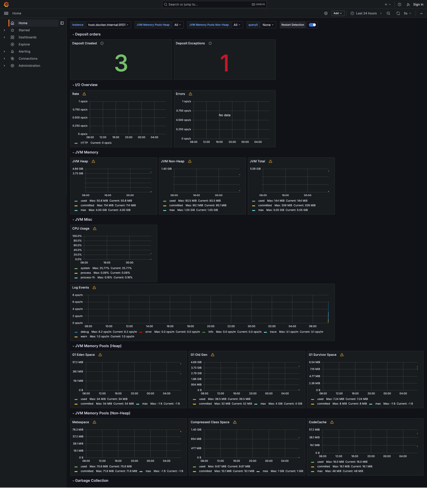
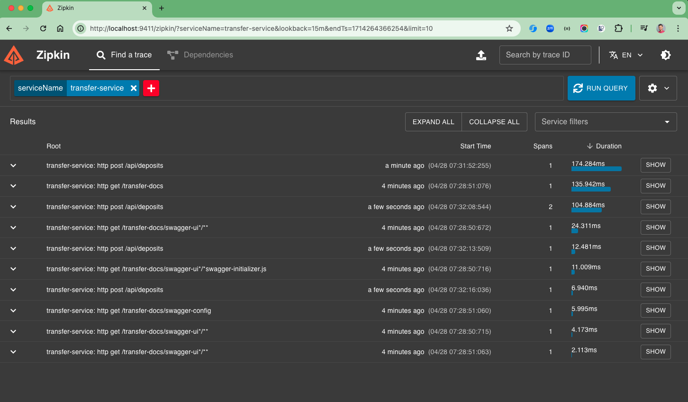
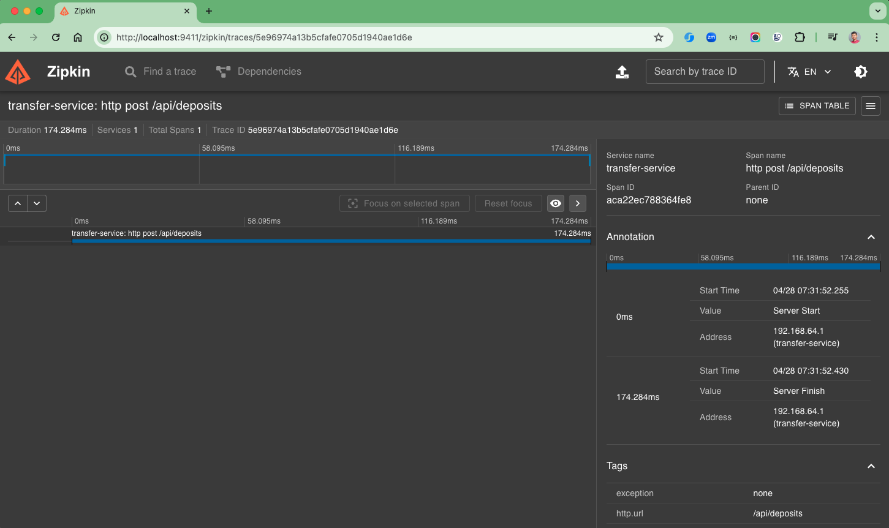

# transfer-service

transfer-service is a Spring Boot application that handles deposit and refund transfer types.

---

### Technologies / Changes

* Java 21
* Spring Boot 3.2.5 version
* Build tool: Maven
* Use docker-compose TestContainers for Integration Tests
* The use of [Spring Data JDBC](https://docs.spring.io/spring-data/jdbc/docs/current/reference/html/)
* Swagger API documentation
* Monitoring and Observability using Spring Boot Actuator and Micrometer
* CI/CD using Github Actions

---

### How to run locally

#### Prerequisites

- JDK 21

### Build

- Go to root directory and run: `./mvn clean install`

### Run

1. While in the `/scripts/` folder, run `./start-services.sh`.
2. Run `./create-database.sh` in the `/scripts/` folder.
3. Run application using: `mvn spring-boot:run`
4. If you want to play around with db, you can run

* `docker ps` and grabbing Container ID for the postgres image and follow with
  `docker exec -it ${containerID} psql transfer_service -U postgres`
  While in the container, run `\dt transfer_service.` you should see a list of created tables.

---

### API Documentation

Access the Swagger API documentation
at: [http://localhost:8080/transfer-docs/swagger-ui-custom.html](http://localhost:8080/transfer-docs/swagger-ui-custom.html)
once your application is running.

### Monitoring / Observability

Access the following endpoints once your application is running:

- Prometheus: [http://localhost:9090](http://localhost:9090)
- Grafana Dashboard: [http://localhost:3000](http://localhost:3000)
- Zipkin UI: [http://localhost:9411](http://localhost:9411)

#### Metrics

In this POC, I used prometheus as the monitoring backend and grafana to create dashboards to visualize and analyze data.
The metrics of the service is exposed through http and prometheus scrapes/collects metrics at that endpoint at regular
intervals.

I used the spring boot production-ready features that are packed in a module
called actuator https://docs.spring.io/spring-boot/docs/current/reference/html/actuator.html.
This module is configured to expose metrics on `/prometheus`.
(It could also expose kubernetes health checks on `prometheus/health/liveness` & `prometheus/health/readiness`.)
All metrics are tagged with `application=transfer-service` which comes from the application name in the spring
configuration.

#### Tracing

Instead of using Sleuth, which is no longer used in Spring Boot 3, I used micrometer-tracing, which provides a simple
facade for the most popular tracer libraries, and letting us instrument our application code without vendor lock-in.
https://docs.spring.io/spring-boot/docs/current/reference/html/actuator.html#actuator.micrometer-tracing

#### Logs

For logging, using Logback and configuring it for different log formats based on the logback_appenders property to use:

- LogstashEncoder for JSON formatting
- Custom pattern for non-JSON formatting

### Concepts / Improvement points

#### Handle idempotency for POST API

I have used database storage to handle idempotency for POST requests , but we could also use distributed Caching via
Redis.
Ultimately, the choice depends on specific use case, performance requirements, and data retention needs, and both
approaches have their trade-offs.

* Database Storage: Reliability, Longer-Term Storage
* Distributed Caching: Performance, Expiration

Also in some cases, we can use a hybrid approach, where we use both caching and a database.
For example, we can use caching for quick lookups and database storage for long-term persistence

#### OpenTelemetry

OpenTelemetry is the observability framework which provides a standard way to collect observability data and export
these data(metrics, traces, and logs) from our applications.
It is vendor-neutral and supports a variety of backends, including Zipkin.
It means we're not locked into a specific tracing or monitoring tool. We can switch or use multiple backends as needed.

### Body Request

```json
{
  "requestUid": "6881763f-d955-40e6-b040-26907c9c6377",
  "customerId": 1,
  "fromAccountNumber": "212",
  "toAccountNumber": "100",
  "amount": 1000
}
```

### Image Screenshot

Swagger UI


Grafana Dashboard



Zipkin Dashboard





